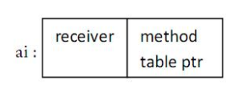

# interfact

接口定义了一组方法（方法集），但是这些方法不包含（实现）代码：它们没有被实现（它们是抽象的）。接口里也不能包含变量。

```go
type Namer interface {
    Method1(param_list) return_type
    Method2(param_list) return_type
    ...
}
```

Go 语言中的接口都很简短，通常它们会包含 0 个、最多 3 个方法。

不像大多数面向对象编程语言，在 Go 语言中接口可以有值，一个接口类型的变量或一个**接口值** ：var ai Namer，ai 是一个多字（multiword）数据结构，它的值是 nil。
它本质上是一个指针，虽然不完全是一回事。


## 接口嵌套

一个接口可以包含一个或多个其他的接口，这相当于直接将这些内嵌接口的方法列举在外层接口中一样。

```go
type ReadWrite interface {
    Read(b Buffer) bool
    Write(b Buffer) bool
}

type Lock interface {
    Lock()
    Unlock()
}

type File interface {
    ReadWrite
    Lock
    Close()
}
```

## 类型断言

```go
if v, ok := varI.(T); ok {  // checked type assertion
    Process(v)
    return
}
// varI is not of type T
```

## 空接口

```go
type Any interface {}
```

任何其他类型都实现了空接口（它不仅仅像 Java/C# 中 Object 引用类型），any 或 Any 是空接口一个很好的别名或缩写。

空接口类似 Java/C# 中所有类的基类： Object 类，二者的目标也很相近。

可以给一个空接口类型的变量 var val interface {} 赋任何类型的值。

## 反射包

反射是用程序检查其所拥有的结构，尤其是类型的一种能力；这是元编程的一种形式。

```go
func TypeOf(i interface{}) Type
func ValueOf(i interface{}) Value
```

## 空接口和函数重载

在 Go 语言中函数重载可以用可变参数 ...T 作为函数最后一个参数来实现。如果我们把 T 换为空接口，那么可以知道任何类型的变量都是满足 T (空接口）类型的，这样就允许我们传递任何数量任何类型的参数给函数，即重载的实际含义。

```go
fmt.Printf(format string, a ...interface{}) (n int, errno error)
```

## 总结：Go中的面向对象

Go 没有类，而是松耦合的类型、方法对接口的实现。

OO 语言最重要的三个方面分别是：封装，继承和多态，在 Go 中它们是怎样表现的呢？

封装（数据隐藏）：和别的 OO 语言有 4 个或更多的访问层次相比，Go 把它简化为了 2 层（参见 4.2 节的可见性规则）:

1）包范围内的：通过标识符首字母小写，对象 只在它所在的包内可见

2）可导出的：通过标识符首字母大写，对象 对所在包以外也可见

类型只拥有自己所在包中定义的方法。

继承：用组合实现：内嵌一个（或多个）包含想要的行为（字段和方法）的类型；多重继承可以通过内嵌多个类型实现

多态：用接口实现：某个类型的实例可以赋给它所实现的任意接口类型的变量。类型和接口是松耦合的，并且多重继承可以通过实现多个接口实现。Go 接口不是 Java 和 C# 接口的变体，而且：接口间是不相关的，并且是大规模编程和可适应的演进型设计的关键。
