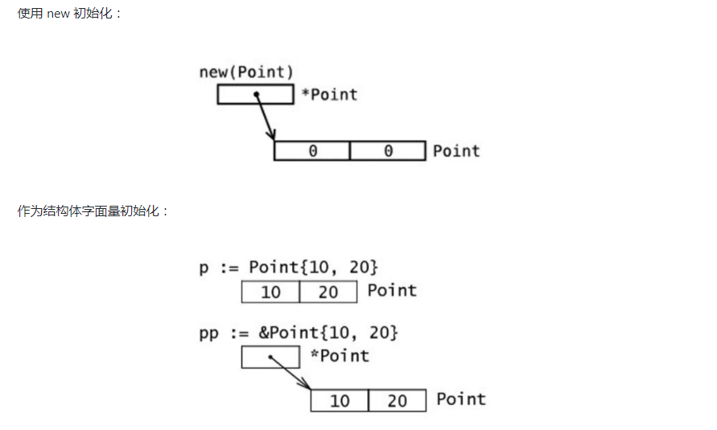
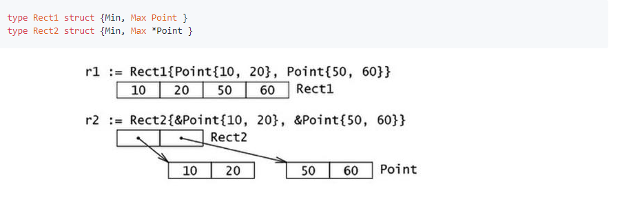
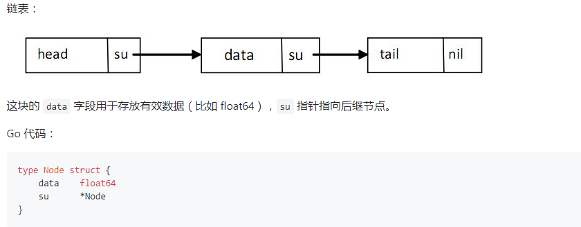
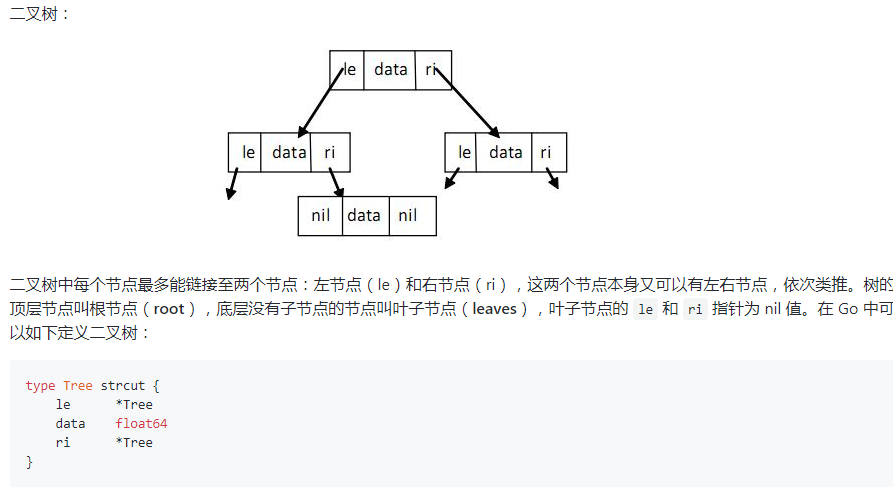

# struct and method

Go 通过类型别名（alias types）和结构体的形式支持用户自定义类型，或者叫定制类型。
一个带属性的结构体试图表示一个现实世界中的实体。

结构体是复合类型（composite types），当需要定义一个类型，它由一系列属性组成，每个属性都有自己的类型和值的时候，就应该使用结构体，它把数据聚集在一起。然后可以访问这些数据，就好像它是一个独立实体的一部分。

结构体也是值类型，因此可以通过 new 函数来创建。

组成结构体类型的那些数据称为**字段（fields）**。
每个字段都有一个类型和一个名字；在一个结构体中，字段名字必须是唯一的。

结构体的概念在软件工程上旧的术语叫 ADT（抽象数据类型：Abstract Data Type），在一些老的编程语言中叫 记录（Record），比如 Cobol，在 C 家族的编程语言中它也存在，并且名字也是 struct，在面向对象的编程语言中，跟一个无方法的轻量级类一样。

不过因为**Go 语言中没有类的概念**，因此在 Go 中结构体有着更为重要的地位。

## 定义

```go
type identifier struct {
    field1 type1
    field2 type2
    ...
}
```

结构体的字段可以是任何类型，甚至是结构体本身

数组可以看作是一种结构体类型，不过它使用下标而不是具名的字段。

## 使用new

```go
var t *T = new(T)

// 可以放在不同的行
var t *T
t = new(T)
// OR
t := new(T)

t.name = "name" //赋值

```

变量 t 是一个指向 T的指针，此时结构体字段的值是它们所属类型的零值。

声明 var t T 也会给 t 分配内存，并零值化内存，但是这个时候 t 是类型T 。
t 通常被称做类型 T 的一个实例（instance）或对象（object）。

## 赋值&获取字段的值

使用**点号符**给字段赋值：structname.fieldname = value

同样的，使用点号符可以获取结构体字段的值：structname.fieldname

 Go 语言中这叫**选择器（selector）**

## 初始化

```go
// 字面量初始化实例 struct-literal
t := &type{"name", 20, "beijing" }
// 或者,混合字面量 composite literal syntax
var t2 type
t = type{"name", 20, "beijing" }
```

字面量写法，底层仍然调用new()。 new(T) 与 &T{} 等价

初始化方式：

```go
type Interval struct {
    start int
    end   int
}

intr := Interval{0, 3}            (A)
intr := Interval{end:5, start:1}  (B)
intr := Interval{end:5}           (C)
```

（A）中，值必须以字段在结构体定义时的顺序给出，& 不是必须的。
（B）显示了另一种方式，字段名加一个冒号放在值的前面，这种情况下值的顺序不必一致，并且某些字段还可以被忽略掉，就像（C）中那样。

结构体类型实例和一个指向它的指针的内存布局,如下图


## 结构体内存布局

Go 语言中，结构体和它所包含的数据在内存中是以连续块的形式存在的，即使结构体中嵌套有其他的结构体，这在性能上带来了很大的优势。
不像 Java 中的引用类型，一个对象和它里面包含的对象可能会在不同的内存空间中，这点和 Go 语言中的指针很像。


## 递归结构体

- 链表



- 二叉树



## 结构体转换

Go 中的类型转换遵循严格的规则。当为结构体定义了一个 alias 类型时，此结构体类型和它的 alias 类型都有相同的底层类型，可以转换。
